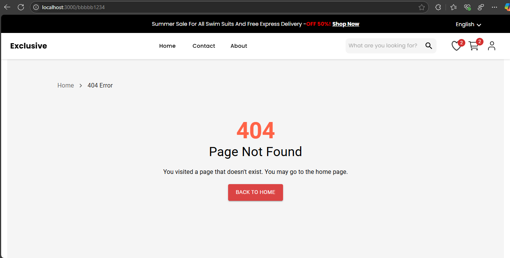
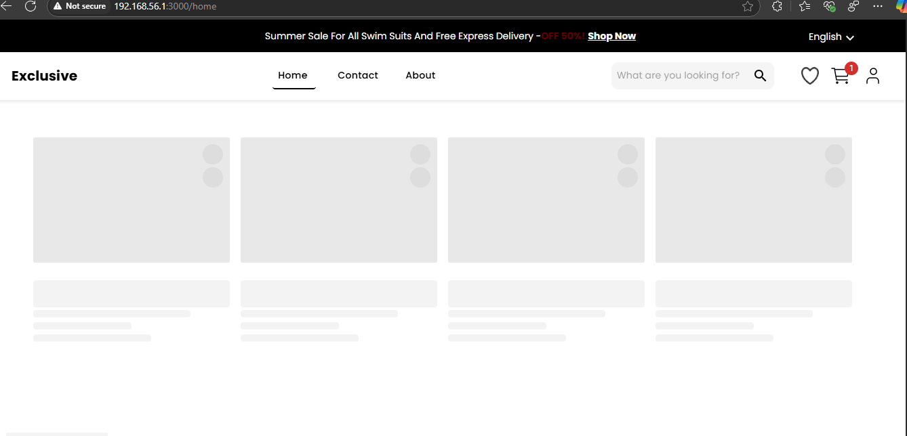

# E-Commerce Web Application 

## **Overview**

This project is a modern e-commerce web application designed to provide an interactive shopping experience. The application integrates with external APIs for product data, user authentication, and order management. It includes robust features for error handling, cart management, user profile updates, and seamless navigation.

---

## **Key Features**

### **1. User Authentication**
- **Sign Up**: Users can create accounts using either email or phone.
- **Login**: Supports two authentication methods:
  - **API-based login** for registered users with a token-based system.
  - **LocalStorage-based login** for locally stored account data.
- **Logout**: Securely clears user session data.
## NB
Unless creating account or login using fakestore api credential accessing to home page is `protected.`
use username and password available on the API and test or create one if you want
[https://fakestoreapi.com/users](https://fakestoreapi.com/users)
---

### **2. User Profile Management**
- **Dynamic Profile Handling**:
  - Fetches profile data from the API if a token is available.
  - Retrieves profile data from `localStorage` for locally created accounts.
- **Profile Update**:
- **Error Handling**: Ensures users are informed of any issues during any process

---

### **3. Product Management**
- **Product Listing**:
  - Fetches and displays product details dynamically from an API.
- **Product Details**:
  - Displays detailed information about a selected product, including description, price, and availability.
- **Error Handling**:
  - Notifies users if retrieving products are fails due to API or connectivity issues.

---

### **4. Shopping Cart**
- **Add to Cart**:
  - Adds selected products to the cart with real-time updates.
- **Update Cart**:
  - Allows users to modify quantities of items or remove products.
- **Cart Persistence**:
  - Maintains cart state using react context
- **Error Handling**:
  - Notifies users if adding or updating products in the cart fails 
  //see screenshot

---

### **5. Order Management**
- **My Orders**:
  - Displays a user’s past orders 
  - Shows order details in a clean, formatted table.
- **Error Handling**:
  - Provides meaningful messages when fetching order history fails or no orders are available.
---

### **6. Wishlist Management**
- **Add to Wishlist**:
  - Allows users to mark products as favorites for future reference.
- **Retrieve Wishlist**:
  - Displays the user's saved wishlist

---

## **API Integration**
The app leverages an external API for:
- **User Management**: Signup, login, and profile updates.
- **Product Management**: Fetching product listings and details.
- **Order Management**: Retrieving and managing user orders.

---

## **Error Handling**
- **Global Error Boundaries**:
  - Ensures the app remains functional during unexpected failures.
- **API Error Handling**:
  - Displays user-friendly messages for issues like:
    - Failed API requests.
    - Authentication errors.
    - Invalid data formats.
- **Form Validation**:
  - Prevents incomplete or invalid data submissions in login, signup, and profile update forms.
## Sample Screenshot
# 1.API fetch Error (error fetched from API)

# 2.404 page

# 3.Add to cart button is Dynamically changed

# 4. Browse by category button is dynamic (fetch respective data dynamically)

# 5. Category fetched from api dynamically linked with browse by categories button fetch respective data

# 6.Cart Page

# 7.carts with empty product

# 8.Empty Wish List (add to wish list using heart icon ,remove them by just click then again)

# 9.Payment Summary

# 10. Payment Summary

# 11. Product Details page

# 12. Order History

# 13.Profile view directly fetched from api 

# 14.Skeleton placeholder until fetching the actaul data 

---

## **Getting Started**

### **Requirements**
- An API endpoint providing product, user, and order data.  [fake store api](https://fakestoreapi.com/)

### **Setup**
1. Clone the repository.
2. Install dependencies using `npm install`.
3. Configure the API base URL in the application.
4. Run the app using `npm start`.

---

## **Future Enhancements**
- **Payment Gateway Integration**: Add secure payment options for order processing.
- **Admin Dashboard**: Include functionality for managing products and orders.

---

This application is designed with a focus on usability, performance, and scalability, making it an ideal foundation for a comprehensive e-commerce platform.